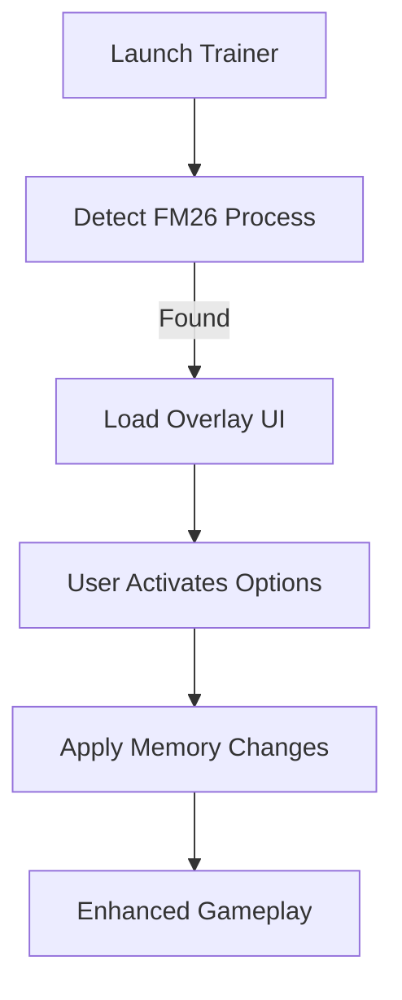

# ⚽ Football Manager 26 Trainer

Take full control of your football dynasty with the **Football Manager 26 Trainer**, the definitive enhancement tool for aspiring managers who crave results without limits. Whether you want to build the richest club, train wonderkids instantly, or outsmart rival tactics, this trainer gives you everything you need to turn your club into a dynasty.

From budget tweaks to advanced scouting manipulation, it’s designed to be both powerful and intuitive — no file editing, no risk, and no delays.

---

## 🏆 Overview

This tool is fully compatible with **Football Manager 2026 (Steam, Epic, and Microsoft Store versions)** and runs safely alongside your main save. The overlay-based trainer modifies memory in real time, letting you apply changes mid-season, mid-match, or during transfer windows.

| Feature                     | Description                        | Default Hotkey |
| --------------------------- | ---------------------------------- | -------------- |
| 💰 Infinite Transfer Budget | Never run out of cash              | F1             |
| 📈 Max Player Potential     | Instantly boosts attributes        | F2             |
| ⚙️ No Board Restrictions    | Unlock all requests & upgrades     | F3             |
| ⚡ Fast Training             | Speeds up skill growth 3×          | F4             |
| 🧠 Perfect Tactics Read     | Reveal opponent formations & roles | F5             |
| 🩺 No Injuries              | Keep your squad fit all season     | F6             |
| 💬 Auto-Win Negotiations    | Always get the deal you want       | F7             |
| 🧍 Instant Morale Boost     | Restore happiness instantly        | F8             |

---

## 🧩 Core Features

* **Real-Time Budget Editor:** Modify finances while transfers are ongoing.
* **Dynamic Training Control:** Override staff presets and force progress per attribute.
* **Instant Scouting Reveal:** View hidden attributes, CA/PA, and agent preference data.
* **Board Freedom Mode:** Unlock stadium, affiliate, and youth facilities without approval.
* **Morale & Chemistry Sync:** Maintain optimal team spirit regardless of results.
* **No Injury Flag:** Removes fatigue, injuries, and suspensions automatically.

[!NOTE]
The trainer updates automatically after each FM patch to maintain offset accuracy.

---

## 🖥 Compatibility

| Component             | Supported      |
| --------------------- | -------------- |
| Windows 10 / 11       | ✅ Full         |
| Steam Build           | ✅ Yes          |
| Epic Games Build      | ✅ Yes          |
| Microsoft Store Build | ✅ Yes          |
| Controller Input      | ✅ Compatible   |
| Linux (Proton)        | ⚠️ Partial     |
| Anti-Cheat Safe Mode  | ✅ Offline Only |

[!IMPORTANT]
Always **launch the trainer before starting Football Manager 26** to ensure correct hook injection.

---

## ⚡ Setup & Use

1. **Download & Extract**
   Place the `FM26Trainer` folder inside your game directory.

2. **Run as Administrator**
   Execute `FM26Trainer.exe` before launching the game.

3. **Activate Hotkeys**
   Toggle desired features in-game via assigned shortcuts.

4. **Optional Config File**
   Customize your keybinds and trainer behavior in `settings.ini`.

```bash
# Example launch sequence
cd "C:\Games\FootballManager26"
start FM26Trainer.exe
```

---

## 📊 Feature Flow



---

## ⚽ Advanced Controls

* **Smart Tactic Engine:** Predicts AI counterplays and adjusts team mentality.
* **Youth Talent Generator:** Spawn regen players with elite stats and hidden traits.
* **Financial Freeze:** Prevents debt accumulation and wage overspending.
* **Match Momentum Bar:** View hidden morale and fatigue factors during games.
* **AI Manager Lock:** Freeze rival club growth and limit scouting efficiency.

[!WARNING]
Avoid enabling “Youth Talent Generator” and “Financial Freeze” simultaneously — it can cause save file inflation on long careers.

---

## ❓ FAQ

**Q1: Can I use the trainer in online career mode?**
A: No. It’s designed exclusively for offline or private local saves.

**Q2: Is my save at risk?**
A: Not at all. The trainer operates in volatile memory — your original saves remain untouched.

**Q3: Are features toggleable mid-match?**
A: Yes. The overlay can be accessed at any time using `F10`.

**Q4: Can I edit staff or player attributes manually?**
A: Yes. The Trainer’s built-in Attribute Editor lets you adjust values between 1–200.

**Q5: Will it detect game updates automatically?**
A: Yes. A background sync checks for version compatibility on startup.

---

## 🧠 Pro Tips

* Use **Fast Training + No Injuries** during preseason for rapid squad development.
* Combine **Board Freedom Mode + Financial Boost** to overhaul facilities immediately.
* Activate **Tactics Read** before derbies for a clear formation counter strategy.
* Use **Morale Boost** before finals to guarantee peak motivation.

[!TIP]
You can export your setup as `.fmprofile` to reuse your trainer configuration in future careers.

---

## 🏁 Final Thoughts

The **Football Manager 26 Trainer** puts you in command of every variable — finances, morale, growth, and AI logic. It’s the ultimate shortcut for players who love mastering the managerial meta without tedious repetition. Rule every league, build your dream club, and cement your legacy in football history.

---

**Win every title. Build your empire.**
*Activate the Football Manager 26 Trainer today and take total control of your club’s destiny.*
